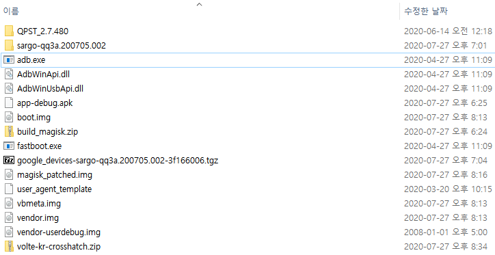

## 보안 패치 이후 VoLTE 작업

> ### 순서
>
> 1. Magisk 루팅
> 2. Magisk에서 VoLTE 모듈 설치
> 3. diag port 개방
> 4. QPST에서 설정 파일 변경
> 5. 순정으로 돌아가기

### 0. 필요한 파일



- 위에서 보이는 파일 중 보안 패치 이후 업데이트가 필요한 파일은 2종임: `sargo-qq3a.200705.002`와 `google_devices-sargo-q3a.200705.002-3f166006.tgz`
  팩토리 이미지와 유저디버그 벤더 파일은 **필히!! 현재 픽셀폰의 버전과 동일한 버전의 이미지를 사용할 것**
- 앞의 파일은 팩토리 이미지로 다음 [링크](https://developers.google.com/android/images#sargo)에서 내려받을 수 있음
  해당 파일에서 추출한 파일은 `boot.img`, `vbmeta.img`, `vendor.img` 3가지임
- 뒤의 파일은 유저디버그 벤더 파일로 다음 [링크](https://developers.google.com/android/drivers)에서 내려받을 수 있음
  `vendor.img` 파일을 `vendor-userdebug.img`로 이름을 변경하여 저장
  해당 벤더 파일을 플래싱하여 diag_port를 개방하도록 함

### 1. Magisk 루팅

- Magisk Manager는 Ghareron772 님의 변형된 버전을 활용하되, 별도로 업데이트가 필요하지 않은 만큼 기존의 파일을 사용

  ```shell
  adb push app-debug.apk magisk_patched.img /sdcard/Download/
  ```

- Magisk 패치를 위해 팩토리 이미지에서 추출한 `boot.img`를 추가로 전송

  ```shell
  adb push boot.img /sdcard/Download/
  ```

- 패치된 매지스크 이미지를 가져오고, 해당 패치 이미지로 부팅하도록 변경

  ```shell
  adb pull /sdcard/Download/magisk_patched.img 
  
  adb reboot bootloader
  fastboot flash boot magisk_patched.img
  fastboot reboot
  ```

- 불필요한 파일 삭제

  ```shell
  adb shell rm /sdcard/Download/boot.img /sdcard/Download/magisk_patched.img
  ```


### 2. Magisk로 VoLTE 모듈 설치

- VoLTE 모듈 전송 (파일명이 길어서 `volte-kr-crosshatch-{버전}.zip`의 `{버전}` 부분은 삭제)

  ```shell
  adb push volte-kr-crosshatch.zip /sdcard/Download/
  ```

- 모듈을 내려받았다면, **Magisk manager에서 메뉴 -> 모듈 -> 추가 버튼 + `volte-kr-crosshatch` 선택**을 통해 모듈을 설치


### 3. diag port 개방

- 유저 디버그 벤더 이미지로 부팅

  ```shell
  adb reboot bootloader
  fastboot flash vbmeta vbmeta.img --disable-verity
  fastboot reboot-fastboot
  fastboot flash vendor vendor-userdebug.img
  fastboot reboot
  ```

- Diag port 개방

  ```shell
  adb shell
  su
  # 스마트폰에서 팝업된 [허용] 버튼 클릭
  setenforce 0
  setprop sys.usb.configfs 1 && setprop sys.usb.config diag,serial_cdev,rmnet_gsi,adb
  ```


### 4. QPST에서 설정 변경

- 필요시 QPST와 퀄컴 드라이버 설치 (`QPST_2.7.480`)
- **NSG** 앱 설치 ([다운](https://play.google.com/store/apps/details?id=com.qtrun.QuickTest)) 후 실행하면 EFS Explorer에서 기기 정보 표시 확인 가능
- EFS Explorer로 픽셀의 모뎀에 접속, 사전에 내려받은 `user_agent_template` 파일을 교체


### 5. 순정으로 돌아가기

- 팩토리 이미지에서 내려받았던 `vendor.img` 파일로 부팅하도록 벤더 복원

  ```shell
  adb reboot bootloader
  fastboot flash vbmeta vbmeta.img
  fastboot reboot-fastboot
  fastboot flash vendor vendor.img
  fastboot reboot
  ```

- Magisk Manager에서 하단의 **제거 -> 완전히 제거** 후 재부팅하여 순정상태로 돌아가기